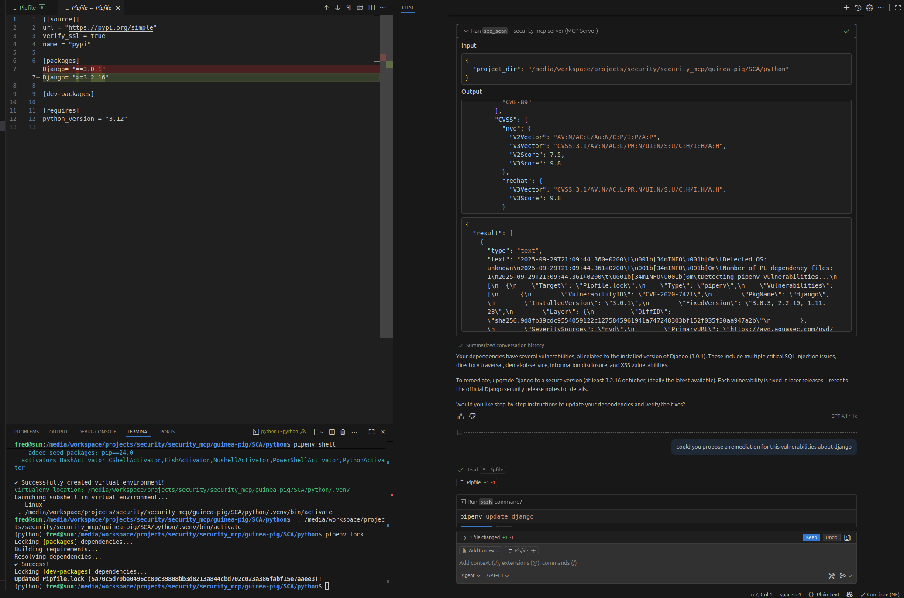
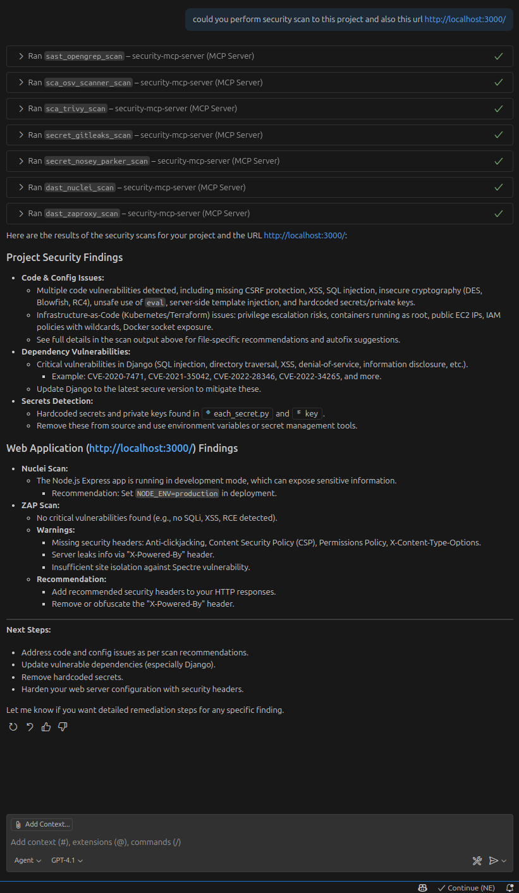

# Security MCP Server

## Objectives
This repository is a simple MCP server's PoC to test and evaluate the **Model Context Protocol (MCP)** technology and integration. 
It facilitated the assessment of integrating security tools within an IDE environment and demonstrated the advantages of leveraging generative AI to support remediation workflows based on report findings.
## What is MCP?

The **Model Context Protocol (MCP)** is a standard that streamlines interaction between AI models and various tools via a client-server architecture:

- **MCP Clients** (e.g., VSCode) connect to **MCP Servers** to request actions on behalf of the model.
- **MCP Servers** provide tools with defined functionalities using a clear and structured interface.
- **MCP** standardizes communication through message protocols for tool discovery, invocation, and response handling.

**Example Use Case:**  
A file system MCP server might enable interaction with tools for reading, writing, or searching files and directories. Analogously, GitHub's MCP server can list repositories, create pull requests, or manage issues.

By standardizing model-tool interactions, MCP eliminates the need for custom integrations between each model and each tool. It also extends the capabilities of your AI assistant by allowing new MCP servers to integrate seamlessly into your workspace.

👉 For more details, explore the [Model Context Protocol specification](https://modelcontextprotocol.io/).

---

## Features
- **MCP Server** performing security scans:
  - **Secret detection**:
    - gitleaks
    - nosey_parker
    - titus
    - kingfisher
    - trufflehog
  - **SCA** (Software Composition Analysis):
    - trivy
    - osv-scanner
    - sca fixes
  - **IaC misconfiguration**:
    - trivy-misconfig (`trivy --scanners misconfig`)
  - **License compliance**:
    - trivy-license (`trivy --scanners license`)
  - **SAST**:
    - opengrep
    - codeql
  - **DAST**:
    - nuclei
    - zaproxy
  - **Pipeline (CI/CD) security**:
    - plumber
- **Aggregated scans** — `static_scan` (directory) and `dynamic_scan` (URL) MCP
  tools run every scanner of a mode, deduplicate findings across tools, and write
  a consolidated `report.md` / `report.json` / `report.html` under `reports/`.
- **Per-scanner toggles** via `.env` — disable any scanner with e.g. `CODEQL=False`,
  `KINGFISHER=off` (see `.env.example`). Applies to the MCP tools and the CLI.
- Remediation suggestions based on findings and leveraging genAI
- **CLI mode** to run a full (or partial) scan and generate a dated, consolidated report

> Every file-based scanner emits **SARIF 2.1.0** (trufflehog's native JSON is
> converted to SARIF internally); zaproxy emits JSON (no native SARIF).

---

## CLI mode

Beside the MCP server, `cli.py` runs the scanners directly and writes a consolidated,
dated report (Markdown + JSON + HTML) under `reports/`. Two modes are auto-detected
from the target:

- **static** — the target is a local directory → SCA / Secret / SAST / Pipeline tools
- **dynamic** — the target is an `http(s)` URL → DAST tools (nuclei, zaproxy)

```bash
# full static scan of a project directory (all applicable tools)
uv run python cli.py ./my-project

# only some tools, explicit CodeQL language
uv run python cli.py ./my-project --tools trivy,gitleaks,codeql --language python

# dynamic (DAST) scan of a running app
uv run python cli.py https://example.com

# add a cross-tool deduplicated findings section to the report
uv run python cli.py ./my-project --dedupe

# pick report formats / output dir, or list tools (disabled tools are marked)
uv run python cli.py ./my-project --formats md,html --output-dir reports
uv run python cli.py --list
```

Each report contains the scanned directory/URL, the total scan + report-generation
duration, and findings grouped by tool with a severity breakdown. Raw per-tool SARIF/JSON
is kept alongside under `reports/scan_<date>_<mode>/raw/`. Generated reports are git-ignored.

Any scanner can be disabled with a `.env` variable named after it (uppercased, `-`→`_`),
e.g. `CODEQL=False` or `KINGFISHER=off`. See `.env.example` for the full list. The same
toggles apply to the MCP server tools.

> Every file-based scanner emits **SARIF 2.1.0** (trufflehog's native JSON is
> converted to SARIF internally); zaproxy emits JSON (no native SARIF).
> `codeql` needs a language (auto-detected from the sources when omitted); `nuclei`/`zaproxy`
> need network/Docker — zaproxy is skipped automatically if its image isn't pulled.

## Tests

`tests/test_scanners.py` builds one example target per scanner family (under
`tests/examples/`), runs every scanner, and asserts each produces a valid report.
A small FastAPI app (`tests/dast_target.py`) is started automatically as the DAST target.

```bash
uv run python tests/test_scanners.py
```

---

## Examples
### Patch proposual



### Full test report and recommendations


---


## Security in MCP Server

MCP implementations focus on security to provide safe interactions between tools, clients, and servers. However, **not all IDEs or MCP's server provide the same level of security**.

To learn more about security considerations for MCP, refer to:  
🔗 [Security Tips for VSCode Extensions and Copilot](https://code.visualstudio.com/docs/copilot/security)

---

## Installation

### Prerequisites
You’ll need the following tools and packages:
- [Python 3.12+](https://www.python.org/)
- [UV](https://github.com/python-poetry/poetry) package manager (already configured).

### Steps

1. **Set up the environment**:
   ```bash
   mkdir .venv
   uv sync
   ```
2. **Install the scanner binaries** (downloaded into `tools/` by each tool's
   `install.sh`; `tools/install-all.sh` runs them all):
   ```bash
   cd tools && ./install-all.sh            # everything
   ./install-all.sh trivy nuclei           # only some tools
   ./install-all.sh --list                 # list discovered tools
   ```
3. **Run the server**:
   ```bash
   uv run server.py
   # or
   source .venv/bin/activate
   python server.py
   ```
   Once the server is running, it will be available on:
   ```
   http://127.0.0.1:8000/mcp
   ```
4. **Configure your MCP client**:  
   Update the client settings to connect to the running MCP server.

---

## Debugging the MCP Server with a Web Inspector

If you wish to debug or inspect your MCP server, you can use the **MCP Inspector**:

```
npx @modelcontextprotocol/inspector
```

This launches a GUI-based tool for debugging and inspecting the behavior of your MCP server.

## Guinea-pig
This is a dedicated project to test the MCP server.

## IDE Compatibility and Recommendations

### **Visual Studio Code**

#### GitHub Copilot:
1. Authenticate with GitHub Copilot.
2. Open the **guinea-pig** project in VSCode.
3. Enable the extension:  
   Navigate to **Extensions → MCP Servers → Installed → Start Server.**

**Usability Note**: Results are functional, but the user experience might need more refinement.

#### Local Ollama Integration:
To use **Ollama** with VSCode, install the [Continue.dev](https://github.com/continue-dev/vscode-continue) plugin. Configuration is straightforward, but the experience might not be as seamless compared to Copilot.

---

### **Cursor IDE**

Cursor works well in building plans, applying changes, and delivering detailed feedback.  
👍 **Best IDE experience so far** in terms of usability and results!

---

### **PyCharm**

Currently, MCP servers using HTTP are **not compatible** with PyCharm.


## License

MIT License